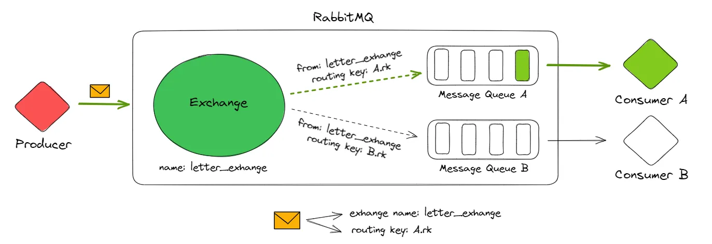
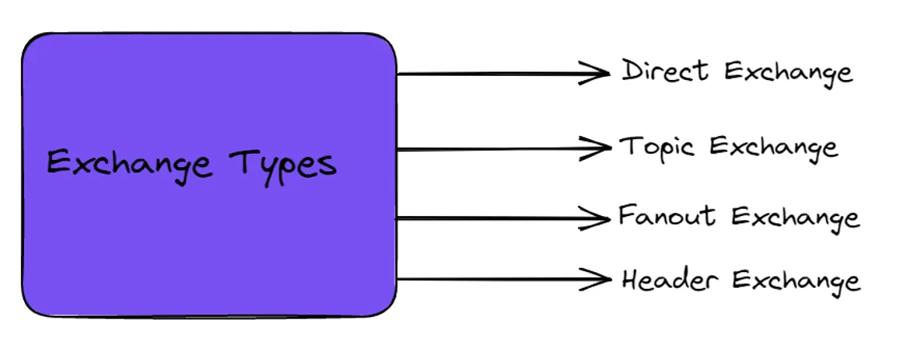
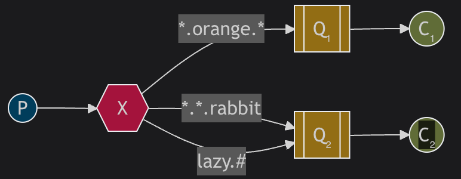

# RabbitMQ Overview and Usage

## Table of Contents
1. [Concepts](#1-concepts)
   - [What is RabbitMQ?](#what-is-rabbitmq)
   - [Basic Components in RabbitMQ](#basic-components-in-rabbitmq)
2. [Usage](#2-usage)
   - [Using `aio-pika`](#using-aio-pika)
   - [Setup](#setup)
   - [Basic Consumer-Producer Patterns](#basic-consumer-producer-patterns)
   - [Timeout Mechanisms](#timeout-mechanisms)
3. [Queue Types](#3-queue-types)
   - [Classic Queue](#classic-queue)
   - [Quorum Queue](#quorum-queue)
   - [Key Differences](#key-differences)
4. [RAFT Consensus Algorithm](#4-raft-consensus-algorithm)
   - [RAFT Concepts](#raft-concepts)
   - [Visualization](#visualization)
5. [Useful Notes](#5-useful-notes)

## 1. Concepts

### What is RabbitMQ?
- RabbitMQ is a **message broker** that facilitates communication between producers and consumers by decoupling them. 
- Messages are sent via a protocol like [**AMQP** (Advanced Message Queuing Protocol).](https://www.rabbitmq.com/docs/protocols) 

#### Benefits:
- Decouple producers and consumers.
    - Producers don't need to care the implementation of consumer and vice versa.
- Supports asynchronous messaging. 
    - Message can be sent without wating for the result.
- Enables scalable and fault-tolerant architectures.
    - The number of remaining messages in queue may be a good metrics to decide increase or decrease the number of consumers.

---

### Basic Components in RabbitMQ
Given that we are using the protocol **AMQP 0.9.1**, RabbitMQ's architecture includes:
- **Producer**: Sends messages.
- **Exchange**: Routes messages to queues based on routing keys.
- **Queue**: Stores messages.
- **Consumer**: Processes messages.

#### Key Notes:
- Exchanges are only involved in producing messages.
- Communication flows: `Producer -> Exchange -> (Routing Key) -> Queue -> Consumer`.

---

## 2. Usage

### Using `aio-pika`
[aio-pika](https://github.com/mosquito/aio-pika) is an asynchronous AMQP client for Python that simplifies interaction with RabbitMQ.

---

### Setup
#### Required Services:
- **RabbitMQ Management**: Use the management version to access a web UI.
- **Consumer**: Service to process messages from queues.
- **Producer**: Service to send messages to exchanges.

---

### Basic Consumer-Producer Patterns

#### Producer - Single Consumer:
* *Present with code*
1. The producer sends messages to a queue via an exchange.
2. The consumer retrieves messages from the queue.

Notes:
- Prefer **long-live connection**, epsecially for continous consumers to avoid connection overhead (authentication, negotiation, ...). [See connection life-cycle](https://www.rabbitmq.com/docs/connections?utm_source=chatgpt.com#lifecycle).

#### (Consumer) Acknowledgements:
- **At least once**: Acknowledge at the beginning to ensure the message is processed.
- **At most once**: Acknowledge late, increasing the risk of duplicates.

- Notes: 

  - The message is difficult to be ensured **Exactly Once** because network parition is inevitable. Instead, any de-duplication methods used with `at least once` can be used. See [You Cannot Have Exactly-Once Delivery](https://bravenewgeek.com/you-cannot-have-exactly-once-delivery/).

#### Producer - Multiple Consumers:

* *Present with code*

- Messages are sent to multiple consumers via:
  - [**Fanout Exchange**](https://www.rabbitmq.com/tutorials/tutorial-three-python#exchanges): Broadcasts messages to all queues.
  - [**Direct Exchange**](https://www.rabbitmq.com/tutorials/tutorial-four-python#direct-exchange): Routes messages to queues that match specific criteria (routing key name).
  - [**Topic Exchange**](https://www.rabbitmq.com/tutorials/tutorial-five-python#topic-exchange): Routes messages based on wildcard (`*`, `#`) patterns routing keys.
  

#### Producer - Multiple Consumers (Single Active Consumer Mode):
* *Present with code*
- Ensures only one consumer processes messages from a queue, even if multiple consumers are connected. See [Single Active Consumer](https://www.rabbitmq.com/docs/consumers#single-active-consumer)

- Benefits:

  - In case the order of messages is important. When failures occur (and re-queue), the broker will try best to put the message to its original position.

---

### Timeout Mechanisms

#### Heartbeat:

- **Definition**: Heartbeats are signals sent at regular intervals (default of RabbitMQ is 60 seconds) to verify the connectivity and liveliness of a worker. See [Heartbeat Timeout Value](https://www.rabbitmq.com/docs/connections?utm_source=chatgpt.com#lifecycle)

- If no response is received, the consumer is marked offline, requiring manual reconnection.

#### Acknowledge Timeout:
- If a consumer fails to respond within the default period (30 minutes), it is marked offline.

---

## 3. Queue Types

### Classic Queue:
- **Single broker node**.
- **Advantages**:
  - Better latency and throughput for transient workloads (no replication).
- **Disadvantages**:
  - Limited fault tolerance.
  - Eventual consistency.

### Quorum Queue:
- **Replicated queues** using the RAFT consensus algorithm.
- **Advantages**:
  - Strong consistency.
  - High fault tolerance.
- **Disadvantages**:
  - Higher latency.
  - Lower throughput due to replication overhead.

Notes: 
- By default, the number of quorum size is 5 (1 master and 4 replicas). See [documentation](https://www.rabbitmq.com/blog/2020/04/20/rabbitmq-gets-an-ha-upgrade?utm_source=chatgpt.com#quorum-queues-in-the-management-ui).

#### Key Differences:
| Aspect             | Classic Queues                       | Quorum Queues                         |
|--------------------|--------------------------------------|---------------------------------------|
| **Throughput**     | Higher for transient workloads       | Lower due to RAFT consensus          |
| **Latency**        | Lower (single-node writes)           | Higher (waiting for quorum ack)      |
| **Durability**     | Optional (persistent/non-persistent) | Always durable                       |
| **Data Safety**    | Moderate                            | High                                 |
| **Fault Tolerance**| Limited                             | Strong                               |
| **Consistency**    | Eventual                            | Strong                               |

---

## 4. RAFT Consensus Algorithm

Quorum queues use the **RAFT algorithm** to maintain data consistency across replicas.

### RAFT Concepts:
- **Replicated State Machines**: Ensures all nodes share the same logs and execution order.
- **Key Components**:
  - **Term**: Logical time for elections.
  - **Index**: Order of log entries.
  - **Log Inconsistency**: Resolved via leader election and log replication.

### Visualization:
[RAFT Consensus Algorithm Visualization](https://raft.github.io/)

---

## 5. Useful Notes:
- When acknowledgements are enabled:
  - **At least once** delivery ensures reliability.
  - Without acknowledgements, delivery is **at most once**.
- Most RabbitMQ versions use AMQP (0.9.1 or 1.0.0).
- Messages are always sent from producers to exchanges, not directly to queues.
